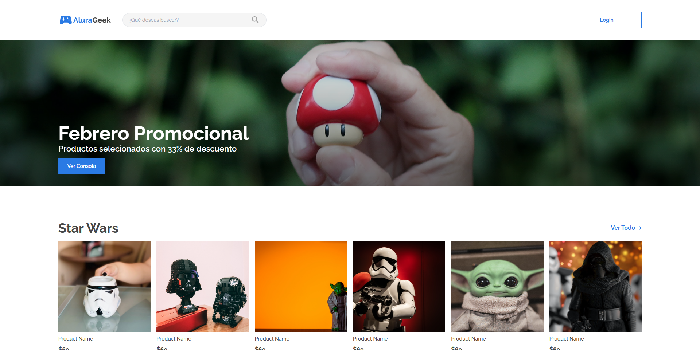

# AluraGeek

This is a solution to the [AluraGeek on Alura Latam](https://www.aluracursos.com/).

### Preview

## The challenge

The challenge was to create an e-commerce website for the company AluraGeek .

### Requirements

A homepage that contains a login button and a product search engine offered by the company.
A banner that includes discounts, promotions, or relevant information of the moment.
A gallery with product information such as image, product name, price, and a link to the product description page.
A product page that contains the image, name, description, and price.
A footer with a contact form and other relevant information.
A login form to authenticate users who want to access the administrator menu.
An administrator menu where they can add, edit, search, or delete products from the store.
It must be responsive to all devices 

### Links

[AluraGeek Live URL](alura-geek-dxci3wk1s-miguelaeb.vercel.app)  

### Built with

- HTML5
- CSS 3
- Tailwind CSS 
- Flexbox
- Grid
- JavaScript
- React JS
- Mobile-first workflow

## Autor

- GiHub - [Miguelaeb](https://github.com/Miguelaeb)
- Linkedin - [Miguel Evangelista](https://www.linkedin.com/in/miguel-evangelista-8458b9150/)
- Instagram - [@Miguel_aeb](https://instagram.com/miguel_aeb?igshid=YmMyMTA2M2Y=)
- Frontend Mentor - [@Miguelaeb](https://www.frontendmentor.io/profile/Miguelaeb)
